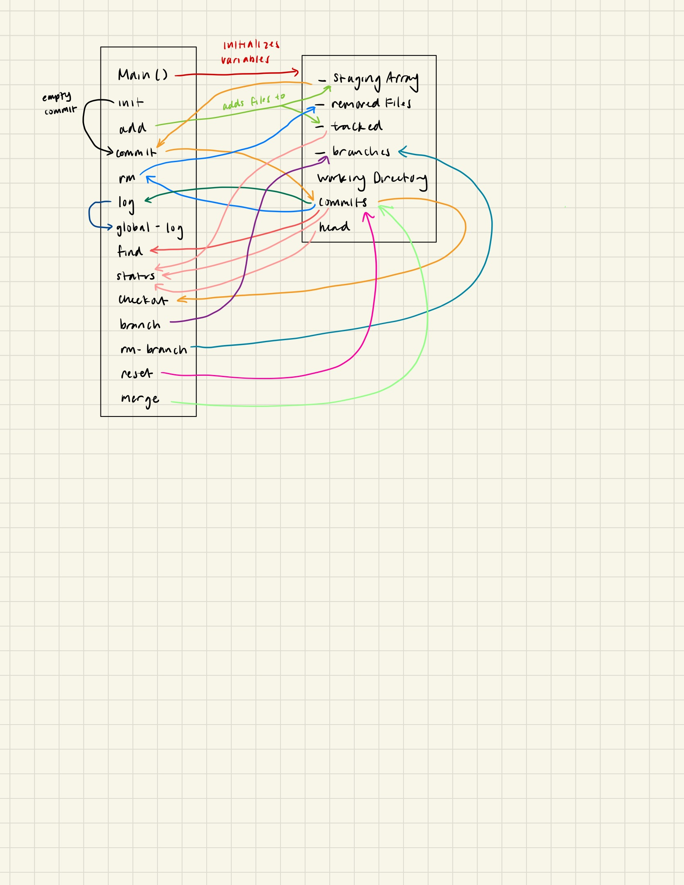

# Gitlet Design Document
author: Chuhui Han

## Design Document Guidelines

Please use the following format for your Gitlet design document. Your design
document should be written in markdown, a language that allows you to nicely 
format and style a text file. Organize your design document in a way that 
will make it easy for you or a course-staff member to read.  

## 1. Classes and Data Structures

### Main

This class houses the overall logic of the Gitlet program, and is where all 
Gitlet commands are stored.

#### Fields

NONE? or none that I can think of right now

### Repo?

This class contains everything that a git repo needs to run, such as a staging
area, a commit tree, and is where the program pulls files from. 

#### Fields

ArrayList<Files> _stagingArray = new ArrayList<Files>:
arrayList of files to be staged, should be empty at the beginning.
ArrayList<Files> _removedFiles = new ArrayList<Files>:
arrayList of files that are removed from the workingDirectory, should be empty
at the beginning.
ArrayList<Files> _tracked = new ArrayList<Files>:
arrayList of files that are being tracked.
Tree workingDirectory = new Tree():
a tree of the working directory, should include all the files that are being
worked on at the moment.

### Commit:

This class stores the commit tree and does the logic for each commit. 

#### Fields: 

ArrayList<Branches> _branches = new ArrayList<Branches>:
arrayList of all branches, or "pointers" to certain head commits.

Tree commits = new Tree():
a tree of commits, starts off empty, and commits are added to this tree.
Tree head = commits.root:
the head of the commit tree, changes according to commits.

### Blob:

This class stores a file's name and contents, and 

## 2. Algorithms

### Main Class

1. init: initializes the directory to become a Gitlet version-control system. 
Creates a commit of no files that has a message "initial commit". Sets the 
master pointer to this single commit, and sets the time of this commit to 
0:00:00 UTC, Thursday, 1, 1970. 
2. add [file name]: Checks if the file has already been staged, if not, adds 
the file to the _stagingArray. If it has been staged, checks if the file is 
the same as the one in the commit by comparing it with the hashCode, if it's
the same, then it removes the file from the _stagingArray. If it's not the
same, it removes the old file in the _stagingArray, and adds the new file. 
Also adds the file to _tracked.
3. commit [message]: Copies the previous commit, and then Adds everything in 
the _stagingArray to the commit tree. Then clears the _stagingArray. Moves head 
to wherever the new commit is added in the tree. Creates String date, time, 
and message variables that track the date and time the commit was made, and 
adds the message of the commit to the String message. Also creates a String 
hashCode that keeps track of the unique hashCode of these commits files.
Head and Master pointers point to the new commit. 
4. rm [file name]: Checks if _stagingArray contains file, and removes it from
_stagingArray if it does. Adds the removed file to _removedFiles. If the file 
is present in the current commit, remove the file from the directory, also
adds the removed file to _removedFiles. If none of these cases are true, then 
it throws an error : "No reason to remove the file". 
5. log: Traverses LRN over the tree of commits starting from the head commit,
and prints "===", then prints "commit" + commit.hashCode, then prints 
"Date: " + commit.date + commit.time, then prints commit.message. 
6. global-log: Iterate over every commit and displays information about each 
commit. Use gitlet.Utils?
7. find [commit message]: Iterate through all commits and checks if each
display has the same message as commit message. If it does, print out that
commit's hashCode on a new line, commit.hashCode. 
8. status: Prints "=== Branches ===", and then loops through the commit tree, 
from the top. If the commit is the head, then it prints "*" + 
commits.head.value. if the commit is not the head, then it just prints
commits.head.value. Then, it prints "=== Staged Files ===", and then it loops
over _stagingArray and prints out the names of each file in that array. 
Then it prints "=== Removed Files ===", and then it loops over _removedFiles
and prints out the names of each file in that array. Then it prints
"=== Modifications Not Staged For Commit ===", and then it loops over all 
files in the working directory and prints it out. If it has been modified,
then it adds "(modified)" to the end of the files name, if it has been deleted,
then it adds "(deleted)" to the end of the files name. Then, it prints 
"=== Untracked Files ===", and finds every file that is in the working
directory that has not been committed or staged, and prints the name of the
file out. 
9. checkout -- [file name]: Loops over the head commit's files and finds the
file with the input file name, then loops over the tree workingDirectory and
removes the file with the input file name, adding the commit's file to the 
workingDirectory at the same place. If there is no file in the head commit, 
exits program and throws error message "File does not exist in that commit".
10. checkout [commit id] -- [file name]: Loops over the commit id's commit's 
files and finds the file with the input file name, then loops over the tree
workingDirectory and removes the file with the input file name, adding the 
commit's file to the workingDirectory at the same place. If there is no commit
with the giving commit id, exits the program and throws error message "No
commit with that id exists.". If there is no file in the head commit, exits 
program and throws error message "File does not exist in that commit".
11. checkout [branch name]: Loops over all the files in the commit at the head
of the input branch name, and adds those files to a new list variable temp. 
Then loops through the workingDirectory tree, and replaces all the files temp 
with the same names, while adding files with different names into the 
workingDirectory as well. If there is no branch with that name, then it 
exits program and throws error, "No such branch exists". If that branch is the
head branch, then exits and throws error, "No need to checkout the current 
branch". If there is a file in the workingDirectory that is untracked and 
would be overwritten, then exits and throws error, "There is an untracked file
in the way; delete it, or add and commit it first". (This should be done first).
12. branch [branch name]: Makes a new Tree with root name that points to what 
is the head of the commit tree. If there is already a branch with this name,
exits program and throws error "A branch with that name already exists", else
adds this branch to _branches.
13. rm-branch [branch name]: Loops over _branches, and removes the branch with
the input name. If the branch with that name does not exist, exit and throw
error, "A branch with that name does not exist.". If the branch that is being
removed is that branch that is pointing to the commit that I am currently on, 
exits and throws error, "Cannot remove the current branch.". 
14. reset [commit id]: Loops over all the tracked files, and if that file is in
the commmit id's tracked files, then calls checkout [commit id] -- [file name]. 
Set's this branch's head to the commit id's node. Calls clear() on
_stagingArray. If there is no commit with this id, exits and throws error,"No 
commit with that id exists.". If there is a file in the workingDirectory that
is not in _tracked, then exits and throws error, "There is an untracked file in 
the way; delete it, or add and commit it first.". (This should be done first).
15. merge [branch name]: Finds the branch that intends to be merged in the 
branches arrayList. Takes that branch, and combines it with the branch that 
head is pointing to right now.

## 3. Persistence

My program would keep each different object separate from each other. Each commit
has its own tree of files, and branches always point to the head of the commit
when they were created. For example, if I added wug.txt to the staging area, 
there would be wug.txt in the _stagingArray. Then if I commit, everything in the
_stagingArray is then put into the commit tree. This process does not change 
anything in the workingDirectory, and the stagingArray also gets cleared after, 
so there is nothing that can break the program after this run.

The most central part of gitlet is the commit tree, and I have made sure that this 
tree is not being modified unless a commit, removal, or merge happens. 

## 4. Design Diagram

